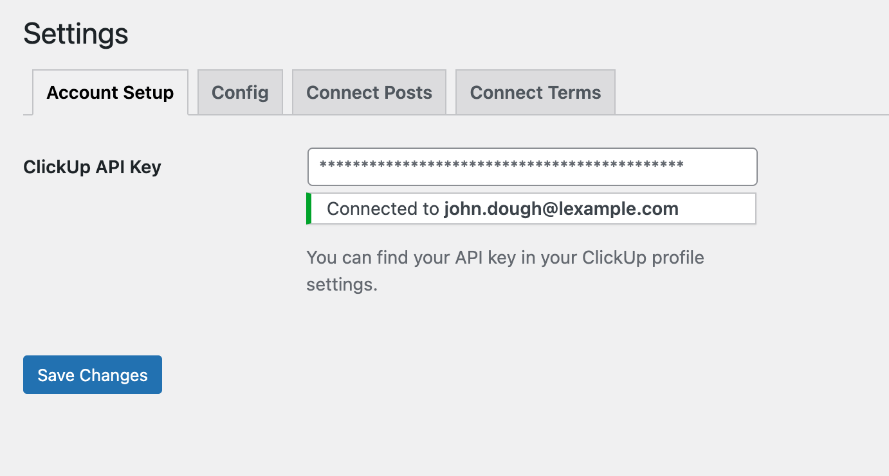
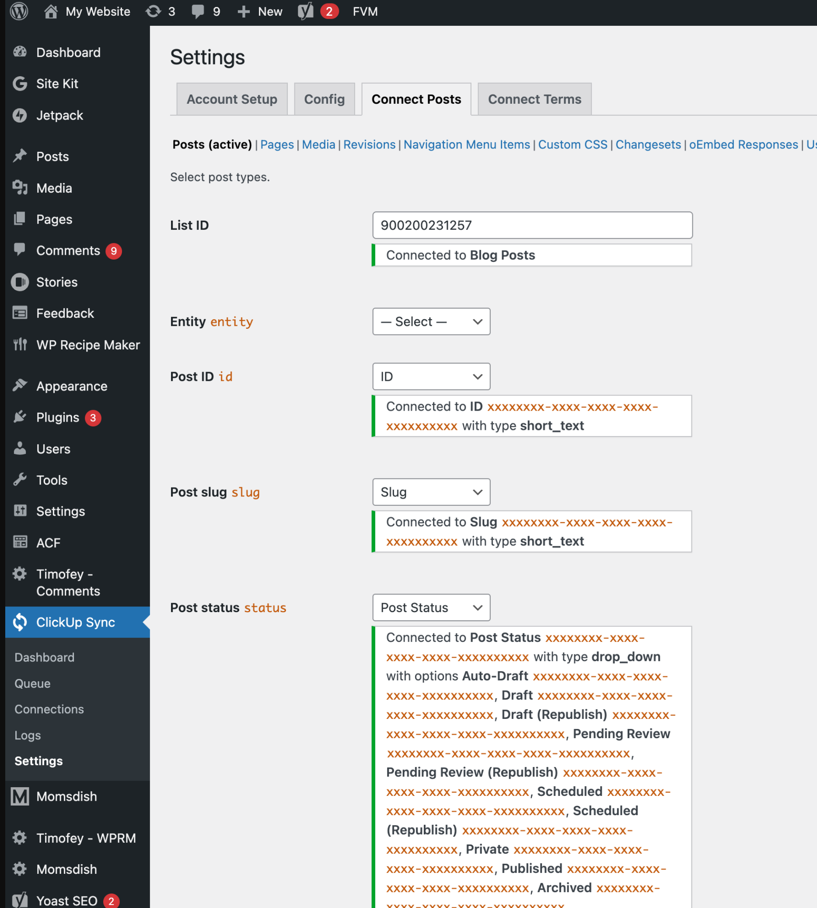

## Description
This WordPress plugin syncs WordPress entities (posts, pages, categories, tags, menus, etc.) with ClickUp tasks.

Additional features:
- A queue system and ClickUp API rate limiter, to avoid hitting the ClickUp API rate limit.
- Connections panel to list all active connections between WP entities and ClickUp Tasks.
- A log system to track all sync operations and errors.

Note: Although this is a fully functional plugin, it's meant to be published as proof of concept, allowing others to
adapt it to their needs.

## Screenshots

## License
This is free and unencumbered software released into the public domain. For more information, please refer to [LICENSE.md](LICENSE.md).